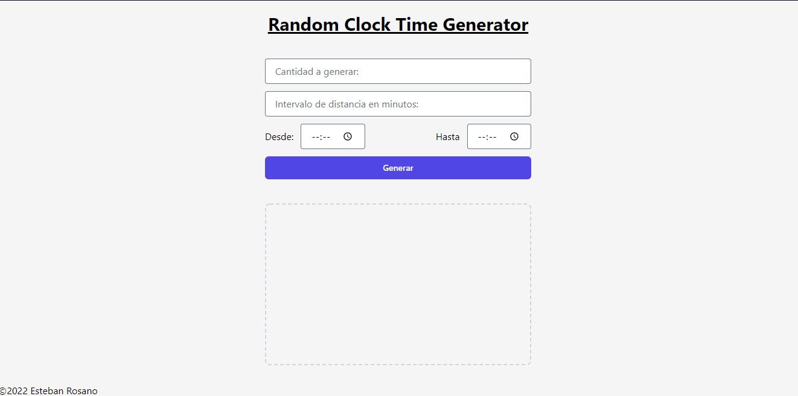
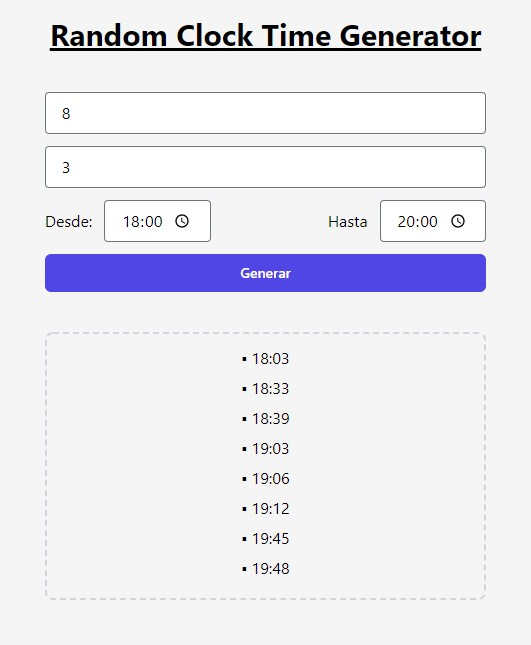
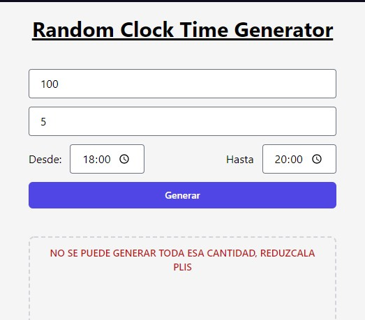
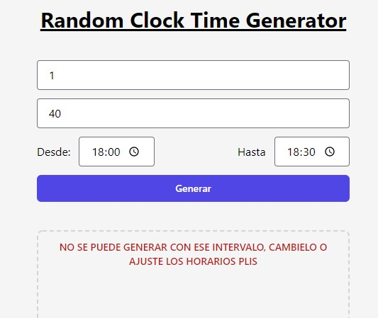

# SOFKA_demo-app-empresarial_FRONT

## Ejecutar el script

In the project directory, you can run:

### `npm start`

Runs the app in the development mode.\
Open [http://localhost:3000](http://localhost:3000) to view it in your browser.

The page will reload when you make changes.\
You may also see any lint errors in the console.

## Ejemplo POST:

### Agregar un nuevo registro de uso de random

### Error al agregar un nuevo registro, cantidad invalida

### Error al agregar un nuevo registro, intervalo invalido

